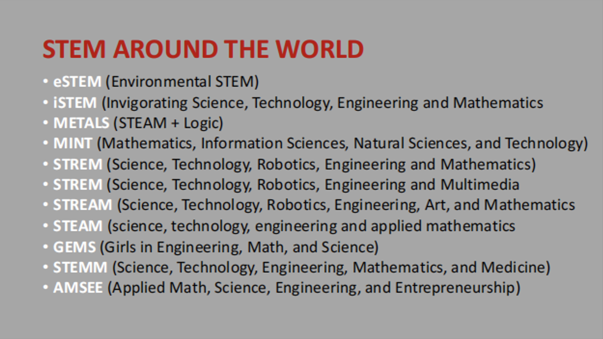
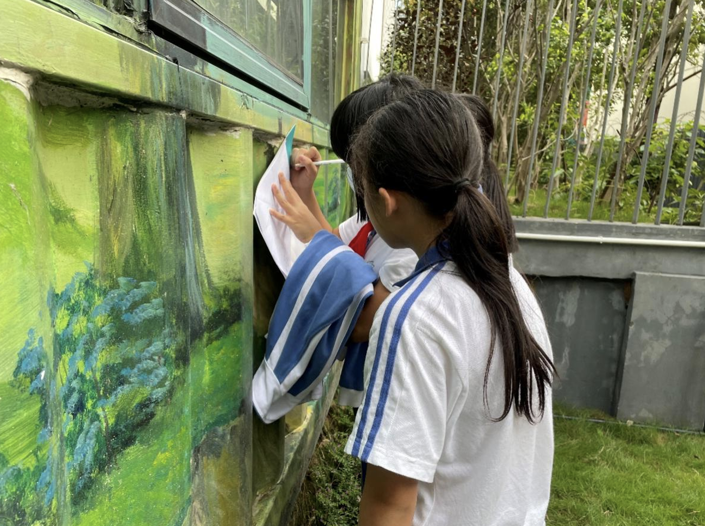
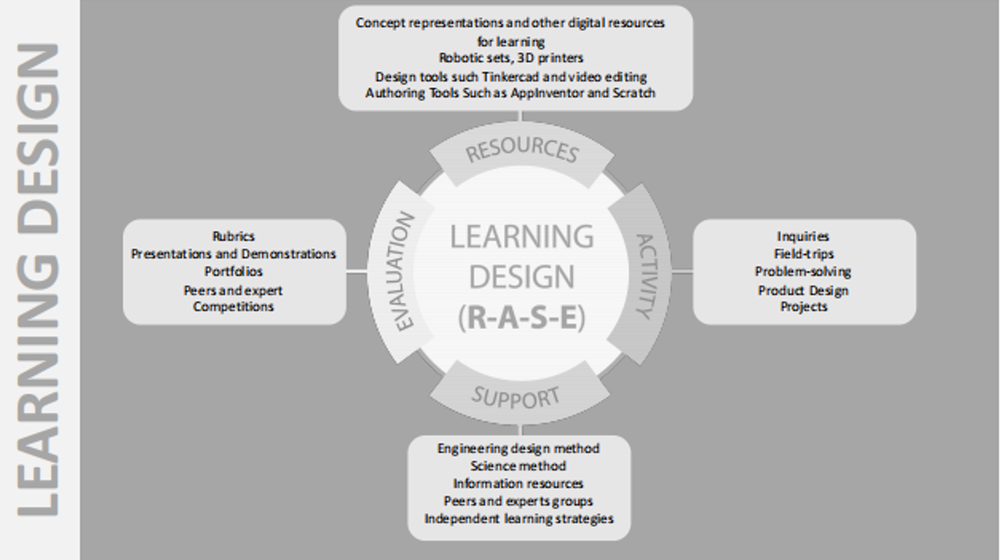
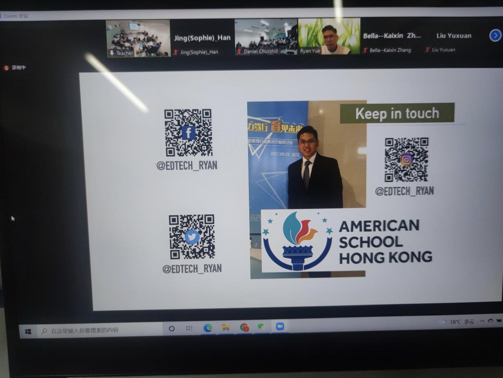

When talking about STEM education, we often feel that it is far away like a mirage and is also difficult to achieve. STEM education provides me an approach from simply integrate disciplines to connect the real world. Inspired by this idea, I designed a “Jungle Adventures”- Garden Design Self-directed Learning STEM Program in Shenzhen. Such a creative program strengthens students’ rights and opportunities to decide for themselves in the learning process compared to the traditional teacher-centered, one-size-fits-all pace, standardized classroom(Chee & Mun, 2011; Hiemstra, 1994). 

During the implementation of the STEAM program, I made full use of the natural resources in the campus, adopted the five SDL indicators, gave students a certain degree of autonomy and provided timely guidance. Teachers turn from authority to facilitator throughout the whole program. The program finally achieved satisfactory expected results. The “jungle” became a “garden” for students to learn joyfully. Most of the students enjoyed their learning progress and activities in their feedback. The outdoor-activity program could effectively improve students' hands-on ability, and train students to become self-directed learners and long-term learners in future STEM programs.  

To teach them to become a scientist or engineer stays a forever debate among teachers. In the case of school practices, it is better to leave the students unfilled with the fixed knowledge in the textbook than to try to cram them full, so as to leave the space for openness and opportunities for creativity and to let students acquire the knowledge internalized by themselves, rather than instilled by teacher’s knowledge. This corresponds with the postmethod pedagogy where learners are encouraged to negotiate and decide on the selection of the learning materials and strategies, while the teacher needs to make sure that the whole of the topic is all present and known to all (Hall, 2017, pp. 117-136). The teacher is disempowered, and the learners are empowered. This compromise of the power transferring has in fact the potential of inspiring learners’ autonomy, sense of responsibility and motivation in this course.

After several program’s experiences in Sciensly primary school in Shenzhen, I had a deeper understanding of “RASE” model from Dr. Daniel Churchill tonight: I recognize it as “key indicators” so that it could guide me when designing a course plan effectively. When it comes to the course framework, what hits me first is “model”, I often divide my course plan into several modules and each represents an indicator in this model......

