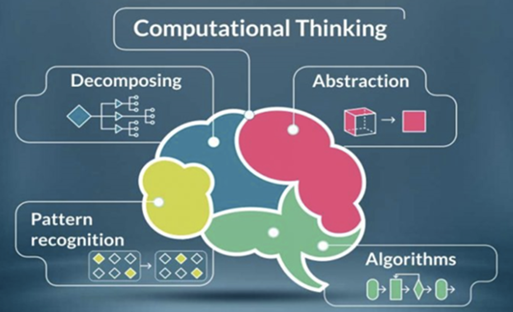
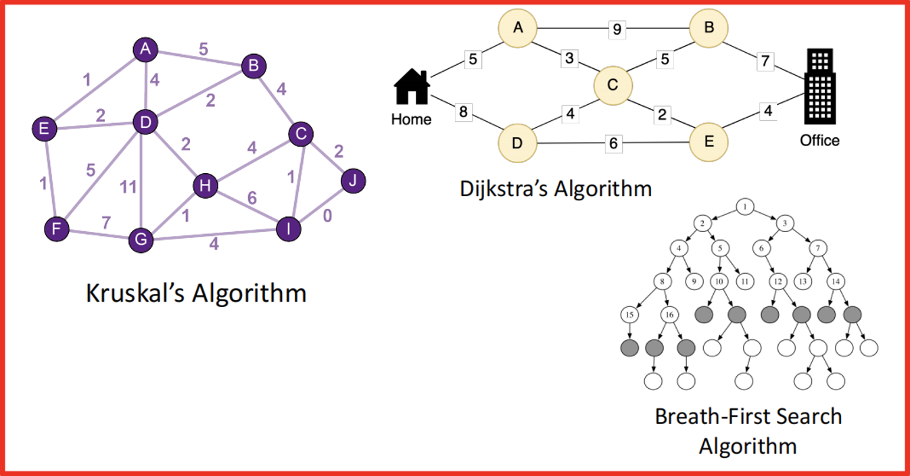
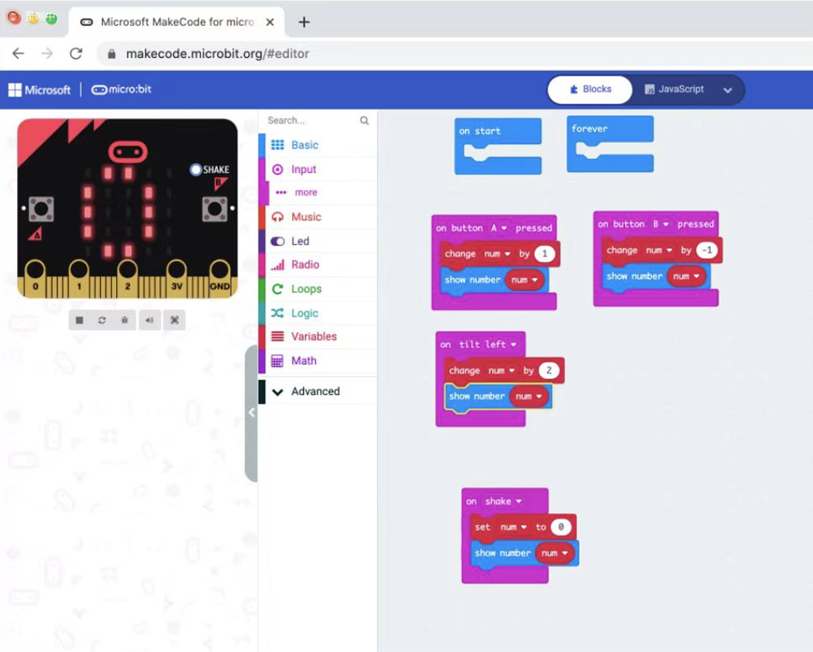

What impressed me most us computational thinking and Algorithmic Thinking today.
Teaching our children computational thinking skills is essential in early childhood.
What computational thinking means to children? 

## Computational thinking

Identify or invent useful abstrations

– Suppressing details, formulating interfaces

Formulate solution to a problem as a computational experiment using abstractions

Design and construct a sufficiently efficient implementation of experiment

Validate experimental setup (i.e., debug it)

Run experiment

Evaluate results of experiment

Repeat as needed

## The three A’s of computational thinking

Abstraction

– Choosing the right abstractions

– Operating in terms of multiple layers of abstraction simultaneously

– Defining the relationships the between layers

Automation

– Think in terms of mechanizing our abstractions

– Mechanization is possible

Since we have precise and exacting notations and models.

## Computational thinking in STEM Education in mainland China

Computational thinking(CT) has become a hot research topic in recent years, especially within primary and secondary education settings(Kallia et al., 2021). Meanwhile, extensive research demonstrates the advantages of integrating CT into mathematics education(Benton et al., 2017; Honey et al., 2014; Yadav et al., 2014). In the last 5 years, education sectors in China show a rapidly increasing demand and interest in STEM education (Li et al., 2020), which provides students with interdisciplinary knowledge and promotes the cultivation of innovative talent.
As (Basu et al., 2016) states, “Computational thinking (CT) parallels the core practices of science,  technology, engineering, and mathematics (STEM) education and is believed to effectively support students’ learning of science and math concepts”.  Integrating the two to support synergistic learning is both challenging and motivating at many aspects. However, when coming to the educational outcome of STEM computational thinking teaching activities, limited instructors are likely to challenge this type of new course design approach and we see that train package for instructors are expected. In the near future, I will try to design more STEM programs in line with this learning approach.

## Algorithmic Thinking

Algorithmic thinking is a derivative of computer science and coding. This approach automates the problem-solving process by creating a series of systematic logical steps that process a defined set of inputs and produce a defined set of outputs based on these.

Algorithmic thinking is not solving for a specific answer; instead, it solves how to build a replicable process -  an algorithm, which is a formula for calculating answers, processing data, or automating tasks.

For example, when we use google maps, The Kruskal Algorithms and Prims Algorithms behind in the software design guide us in a logical and effective way. Here students' learn goals of mathematics could then be transformed into the design of minimum spanning tree algorithm.

## Computational Thinking, Educational Robots & Coding

The first time I try microbit programing, it is so fantastic and easy to learn! I have to wait to conduct this technology into my class! I have a motivated group to go, there we handles most of the problems in class, and after class, we still keep in close touch and tried more practices together!
