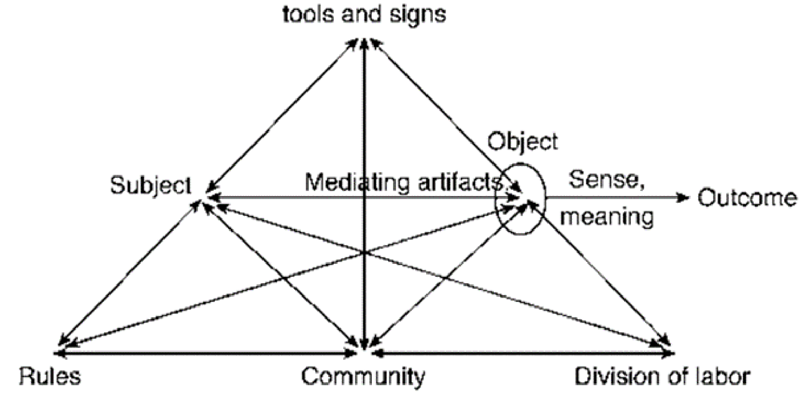
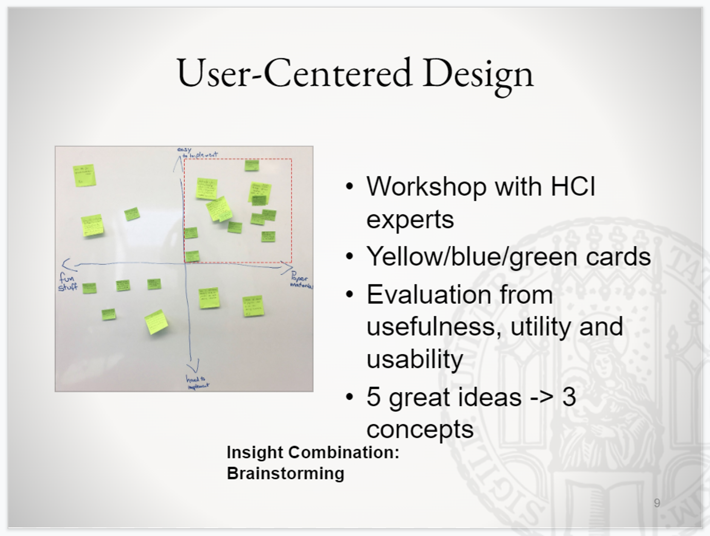
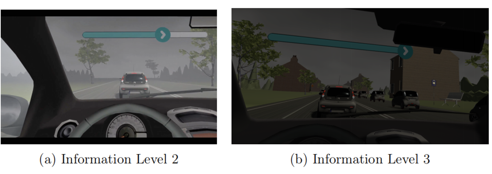
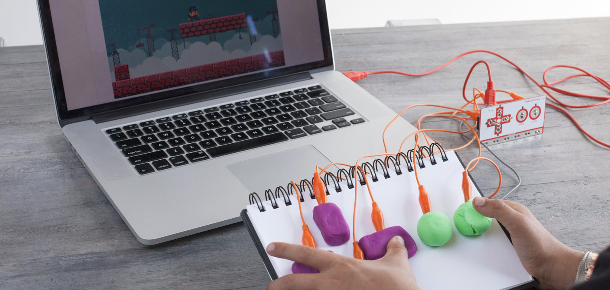

## Activity theory from HCI

Rather than conceptualizing STEM based on ‘Integration model,’ HCI approach is to explore ‘Interaction model’.

## Activity Theory

Activity theory, first initiated by Lev Vygostsky has evolved through three generations and is widely applied in many fields such as social science, economics, politics, etc(Engeström, 2001). Here we mainly talks about the second version developed by Engeström devi Lev Vygostsky’s theory to conceptualize technologically innovative designs for STEM education. 
Figure 1 is a graphic model of activity theory(Engeström, 2015) to explicate the relationships between components of an activity system.

There are several principles of activity theory and among them three are highlighted. This theory points out the importance of interactions between subjects and objects. The needs of subjects, in this study, students’ learning interests in biology are met through the interactions between subjects and objects. Secondly, mediation is the lifeline to connect the individual mind and the world. Interactive technologies are mediating artifacts for students to achieve learning outcomes(Engeström, 1999). Students interact with the knowledge of the circulatory system through VR. The study of human-computer interaction can be used to understand how VR as an interactive technology facilitates the interactions between subjects and objects. Various human-computer interaction styles are optional for learning design: such as Command language, question and answer, Menus, Form filing, Function keys and Graphical direct manipulation(Shneiderman, 1988).

## HCI

HCI is not primarily the study of Human/Computer, but it analyze the interactions between them as well as the consequences. I have 3 years of HCI design experiences when studying in the university of Munich in Germany. There I even finished my bachelor thesis related to user-centered design with the help of VR headset! Our group came up the the idea of applying VR technology into education naturally and we are quite confident to carry on.

Last week I received a courier package from Makey Makey, and I tried to make a fruit battery, which is exactly in the sixth grade science textbook in Shenzhen. The STEM program was unexpected popular and it encouraged me to put forward to develop new programs. My new idea is game learning. The session of the makey makey play  is designed with social interactions to affect students' communication skills, mutual respect through the rules in the game to control emotions and empathy between them(Suherman et al., 2019). Students are innovated to move forward when they interact with other learners which could lead to deeper understanding and further interest into the subject or topic being studied(Banz, 2009).

