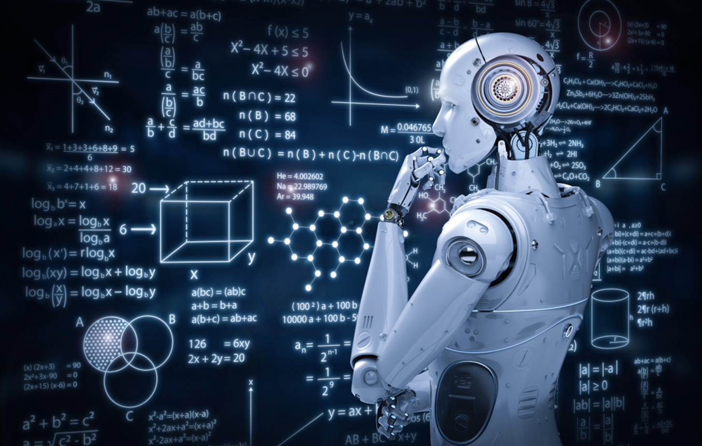

Today I listened to the Prof.Khoo’s lecture, and I was very happy with the full harvest.

The development of science and technology is now very fast, and it is changing our life day by day, especially  the artificial intelligence and big data. Online shopping platforms can recommend the products we want to us with big data, and short video platforms also rely on big data to give us We push the videos we want to watch, and now, AI intelligence and big data are slowly affecting our education.

First of all, artificial intelligence and big data can not only reduce the burden on us teachers, but also allow teachers to better teach students according to their aptitude.

For example, when I assign online homework, students can use the computer to correct the homework directly. This not only greatly reduces the burden on teachers, but the platform can also help us analyze the correct rate of students. After collecting the data of students, we can clearly know the difference Where are the shortcomings of the students, which students have not mastered the basics well, and which students are better.

Then, according to the situation of different students, we will arrange homework of different difficulty in a targeted manner, so that we can be more targeted, so that the outstanding students can go to the next level, and the underachievers can lay a solid foundation.

Secondly, it enriches the current classroom form, improves students' interest in learning, and makes the learning atmosphere of the class more intense and students’ learning interests are high this way.

For example, in the current smart classroom and smart classroom, our teachers can use the platform to better display our classroom content. I myself use a software called "Flying Speed Thinking". Log in at the same time as the students in class, the teacher asks questions in the class, and the students write the answers on the tablet. At this time, the platform will automatically judge whether it is right or wrong, and the teacher can also grasp the classroom mastery of each student, which not only improves the students' classroom participation It also improves students' interest in learning.

I very much look forward to the early popularity of artificial intelligence and big data across the country, so that students across the country can enjoy the most advanced education.
