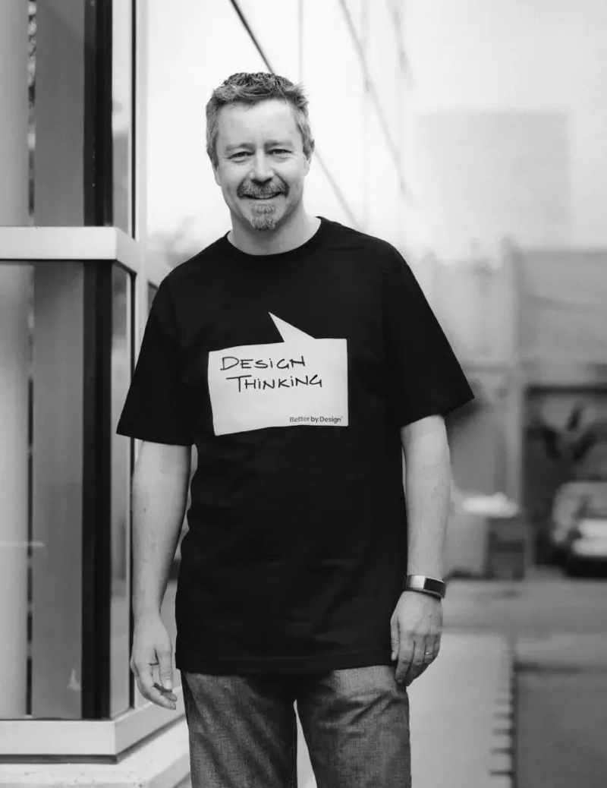

The first time I heard design thinking, actually I had no special experience with this tool at that time and just thought it's a tool, a bit like brainstorming. But it is not the same as brainstorming, it will test and verify everyone's ideas, thus ensure the feasibility of these ideas. 

After the lesson, I also looked up some materials and did some learning and understanding. I knew that it was a model of innovative thinking, but I still didn't realize its special difference.

 
When we learn something new, we usually have a few questions: What is it? Why is that? What's the use? How does it work? So what is design thinking? Tim Brown, the CEO of IDEO, a well-known design company, defines design thinking as an approach to innovation that balances user needs, technological feasibility and corporate profits. My understanding of this sentence is that design thinking is an innovation method, a tool and a methodology. However, for every areas, innovation is not unconstrained. Innovation is not just about users' needs, but also to ensure its feasibility. So, it's a balance of all these points.

 
Design Thinking is a creative and Design methodology that seeks innovative solutions to a variety of issues and creates more possibilities. Design thinking, as a set of problem-solving methods, allows you to see the world in a different way, to think in ways you didn't know before. Tim Brown, president of IDEO Design Company, once defined in Harvard Business Review: "Design thinking is a human-centered approach to innovation that draws from the designer’s toolkit to integrate the needs of people, the possibilities of technology, and the requirements for business success." Design thinking is differentiated from analytical thinking by its process of "inspiration", "ideation" and "implementation". The nature of thinking is "life", the process of ideation is "professional" and the results of implementation are "universal". Among them, the thought process consists of three elements: insight, observation and empathy, and three principles: feasibility, persistence and neediness.

Do market research, understand customer needs, dismantle competitors' products, improve functions and styles step by step, optimize and launch new products. This is the traditional product development routine. With the arrival of the commodity era of oversupply, people have to feel more and more critical eyes of customers, their lack of loyalty to the brand, more and more impatience for homogeneous products. The question that all enterprises have to think about at this time is: how can they innovate in product development? How can their products impress customers? Does it take a genius like Steve Jobs to bring us new products that glow and delight in our hearts? It is clear that we need new, groundbreaking innovative thinking and methods to develop moving products. Is it possible? Design thinking made it. 

How important is it to think like a designer? Thinking like a designer can transform the way organizations develop products, services, processes, and strategies. This approach, known as design thinking, integrates human needs with technical feasibility and business sustainability. Not only that, but it also allows people who are not designers to use innovative tools to solve challenges. 

Human needs is one of the core of design thinking, which is what we call "people-oriented". From the standpoint of consumers, we can actually experience what they experience and know what they will do, so as to better inspire our design.  

Designing and thinking with 3D meets the rising demands from different areas. With the development of 3D printing in industry, it's applied to all kinds of common things. Aectual, a Dutch firm, has installed 3D-printed floors for a number of clients. 3D-printed ovaries are expected to give more women reproductive rights. Metal 3D printing is invading industries at an incredibly high rate. Local Motors promotes 3D-printed self-driving mini buses……Of course, these are all done under the guidance of design thinking. 

As our planet and society begin to face daunting challenges, including changing political structures, climate change, the rise of automation, changes in social welfare systems and growing gaps in education, the power of design thinking is more evident than ever.There is no doubt that design can change the world.
