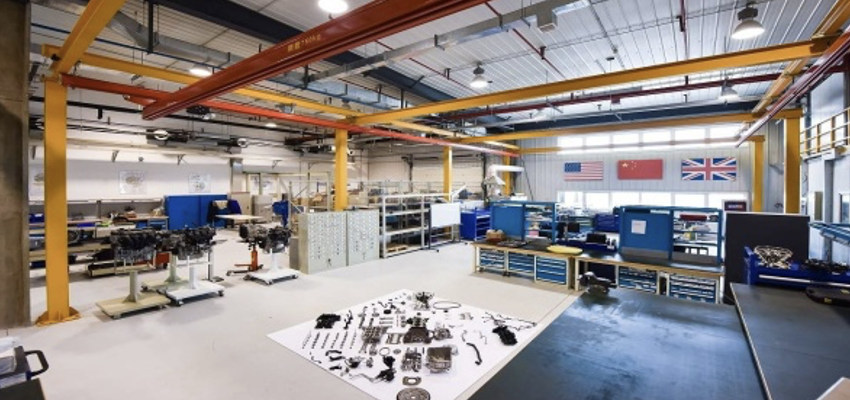

“Raising a maker-kid doesn’t mean we have to outfit our homes or classrooms with high tech equipment or tools.” What is makerspace? It is a place where students can learn to use material, tools, design, and create a prototype using their hands-on skills and scientific knowledge. It encourages students to explore, tinker, and build while understanding the integration of STEM (Science, Technology, Engineering, and Math) in everyday life. “It is a place where students can go and have an opportunity to explore their own interests; learn to use tools and materials to create and solve problems. ”

 
MakerSpace, which has become a hot topic in the education world, aims to challenge students in elementary school, middle school and high school with hands-on, personalized experiences to create and learn. 
 

With the wide application of makerspace, its advantages gradually become prominent. Makerspace provides opportunities for innovation. Makerspace promotes innovation through hands-on experiments where participants have the opportunity to innovate and apply personalized learning strategies to change existing concepts or develop their own ideas, methods or products.

Makerspace creates a real application. Hands-on learning moves participants from abstract concepts to an understanding of the real world by teaching concepts through lectures, videos or textbooks. In addition, participants can practice creating solutions to real problems.

Participants can learn from failure. In experiments, testing, evaluation and modification are part of the process. Participants learn how to turn failure into a learning experience and not get frustrated or frustrated when something doesn't go according to plan.

Makerspace brings new learning opportunities. Makerspace offers the opportunity to learn new things, whether it's learning alternatives to methods or leveraging new tools and resources to reach new solutions.

In addition, makerspaces fosters critical thinking and problem-solving skills. The ability to solve problems critically and effectively should be established at an early age and developed over time. These skills are the foundation and enhancement of the learning experience in makerspaces.

New skills emerge in the 21st century. These skills go beyond critical thinking and problem solving. These important skills include flexibility, collaboration, adaptability, oral and written communication, information literacy, technical literacy, productivity, social skills, leadership, initiative, etc. These essential skill sets help develop young talent for future success.

All these advantages of makerspace show us its importance. So here's the question: how to set up a MakerSpace?

1.	Meaningful purpose
First, set goals for your space. Think about how you want students to use the space and what you want to accomplish at MakerSpace.

2.	The right material
The ultimate goal of a makerspace is to foster a maker mind in students, which can be achieved through beautiful technology, but can also be achieved using recycled materials and tape. Whatever the size of your budget, filter all purchases through goals and objectives.

3.	Organized use of space
Once you have collected items in space, you need to organize them. Teaching time is minimized by keeping supplies organized so that students don't waste time tracking items. It is recommended to use transparent plastic containers for storing materials, as this makes it easy to see and label the contents.

 
4.	Well-managed
The most important part of a meaningful makerspace is having routines and programs that work. Procedures are in place to keep materials in order and the space clean. Routines need to be established for the group to work with, and group roles and expectations should be taught, modeled, and continuously practiced. 
 

5.	Perfect operation process
Students should use specific engineering design processes as they explore makerspaces. Students need to be guided before they start using engineering as part of their challenge.

6.	Meaningful tasks
Meaningful tasks should start with structured tasks for the whole team and then move on to group and individual tasks. The course includes plan templates, sample STEM challenges, sample task cards and editable task card templates.
