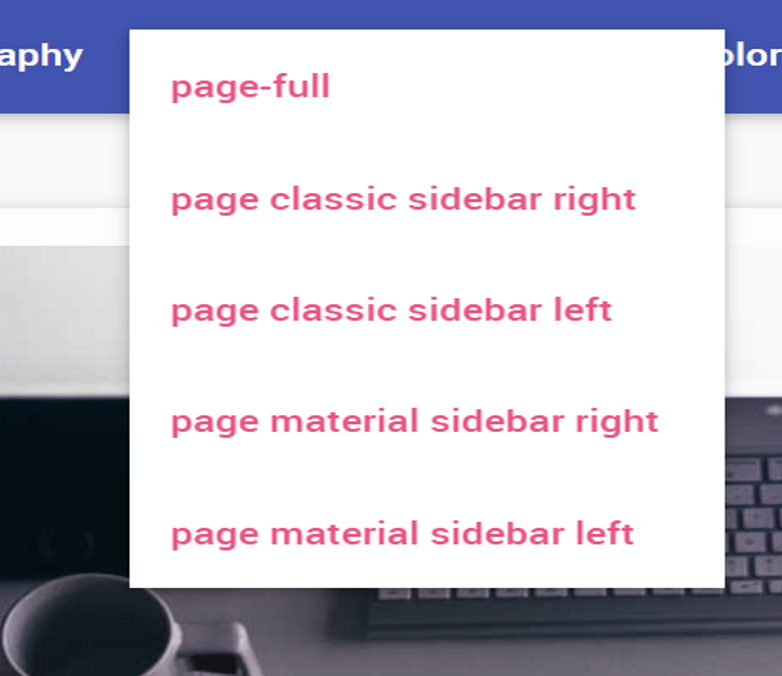

What impressed me most today was the study on GitHub. Although our group was still confused at the beginning, we quickly found the right direction and carried on. After class, I was silent alone for a long time, and finally got an idea: why can’t I? It's been a long and difficult process from registering to imitating and learning the code source. I'm not sure if it will be successful in this process, as you can see, if you right now you can see a GitHub website page... Well, at least, I make it! Three months of MEDD 8860’s study is quite short. Although this class is coming to the end, the learning will never stop! I think this page will be updating, updating and updating all the time as soon as I keep this warm passion.

