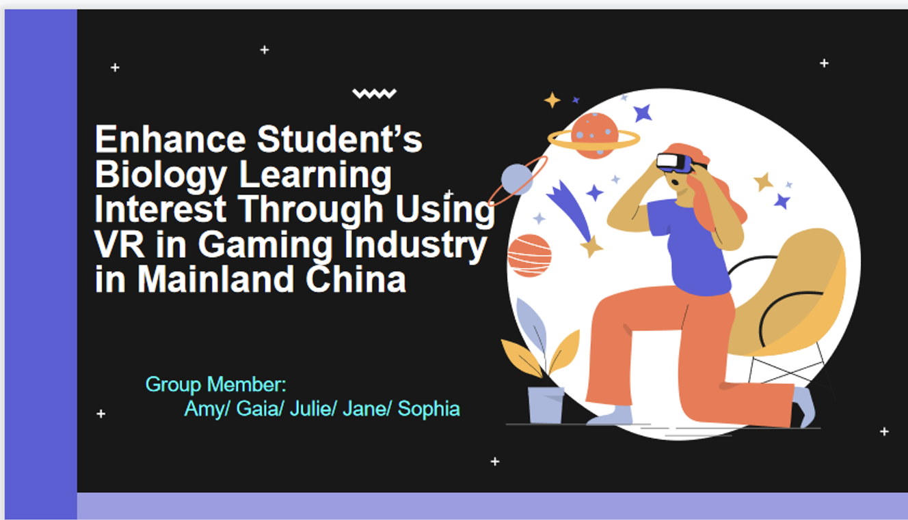

We enjoyed the presentation very much. Although I was a little nervous, I could still tell that every member had tried their best and we received respect from our peers and professors. I have also learnt a lot from my peers sharing. Still excited with that night, I hope in the near future, my professors and classmates could see such a big improvement in the area of education.

